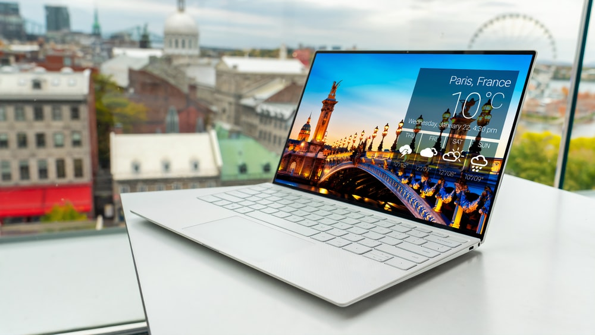

# project
<!DOCTYPE html>
<html lang="en">
<head>
    <meta charset="UTF-8">
    <meta http-equiv="X-UA-Compatible" content="IE=edge">
    <meta name="viewport" content="width=device-width, initial-scale=1.0">
    <link rel="stylesheet" href="style.css">
    <title>Laptops </title>
</head>
<body>
    

 <h1>This page will help you in selecting your device.</h1>   
 
There are no such specified laptops for coading, you can also code on a device having minimum specification. 
   Only thing that you have to keep in your mind that you might be running some heavy softwares like android studio and other at the same time which needs a little higher end cpu and gpu to do so.
   Devices are listed below with there specifications and other details along with the price and buy links, after going through all the devices you will be get a comparision and at the last which should be preferred more than others.

<h2>50-60k range</h2>

<h2><u>The minimum criteria for this price range should be:-</u></h2>

    <ul>
    
<li>CPU :- Ryzen 5 5000 serires/ i5 11 Gen.</li>

    
<li> Ram :- Minimum 8 GB DDR 4 3200MHz.</li>

        
<li> Rom: SSD 256 GB SSD and a hardisk slot or hardisk.</li>

            
<li> Display: min. 15.6 inches and 60 hz, ips pannel.</li>

                
<li> Gpu 2gb min.</li>

  
            </ul> 
            <ol>
                
                <h2><li>Hp Pavilion 15   </li></h2>
                <h2><u>Specifications:-</u></h2>
               <ul><li>Brand            - HP</li>
                    <li>Product name - HP Pavilion Laptop 15-eh1101AU</li>
                    <li>Product number - 4X7E6PA</li>
                    <li>Microprocessor - AMD Ryzen™ 5 5500U (up to 4.0 GHz max boost clock, 8 MB L3 cache, 6 cores, 12 threads)</li>
                    <li>Chipset- AMD Integrated SoC</li>
                    <li>RAM - 8 GB DDR4-3200 MHz RAM (2 x 4 GB) upgradable upto 16gb</li>
                    <li>Video graphics -  AMD Radeon™ Graphics(Integrated).</li>
                    <li>Hard drive 512 GB PCIe® NVMe™ M.2 SSD upgradable upto 2 TB.</li>
                    <li>Display -15.6" diagonal, FHD (1920 x 1080), IPS, micro-edge, BrightView, 250 nits, 45% NTSC</li>
                    <li>Wireless connectivity- Realtek RTL8822CE 802.11a/b/g/n/ac (2x2) Wi-Fi 5 ® and Bluetooth® 5 combo.</li>
                    <li>Expansion slots- 1 microSD media card reader; 1 multi-format SD media card reader</li>
               `    <li>External ports- 1 SuperSpeed USB Type-C® 10Gbps signaling rate (USB Power Delivery, DisplayPort™ 1.4, HP Sleep and Charge); 2 SuperSpeed USB Type-A 5Gbps signaling rate; 1 HDMI 2.0; 1 AC smart pin; 1 headphone/microphone combo</li>
                    <li>Minimum dimensions (W x D x H) - 36.02 x 23.4 x 1.79 cm</li>
                    <li>Weight - 1.75 kg</li>
                    <li>Power supply type - 65 W Smart AC power adapter</li>
                    <li>Battery type 3-cell, 41 Wh Li-ion</li>
                    <li>Battery life - Up to 8 hours and 45 minutes, Video Playback Up to 9 hours and 15 minutes </li>
                    <li>Webcam :HP Wide Vision 720p HD camera with integrated dual array digital microphones.</li>
                    <li>Audio - Audio by B&O; Dual speakers; HP Audio Boost</li>
                    <li>Operating system - Windows 10 Home 64 upgradable to windows 11. </li>
                    <li>Software included - McAfee LiveSafe™ , Microsoft office 2019</li>
                      <li>Back lit keyboard                      </li>              
                      <li>Date First Available	24 August 2021</li>
                    </ul>

           </ol>
          <button><a href="L2.html">Next</a></button>  

</body>
</html>
<!DOCTYPE html>
<html lang="en">
<head>
    <meta charset="UTF-8">
    <meta http-equiv="X-UA-Compatible" content="IE=edge">
    <meta name="viewport" content="width=device-width, initial-scale=1.0">
    <title>Laptops</title>
    <link rel="stylesheet" href="style.css">
</head>
<body>
    

    

    <h1>This page will give you options availalbe between 60-70k, with specifications and other details along.</h1>
    <h2>60-70k range</h2>

    <h2><u>The minimum criteria for this price range should be:-</u></h2>
    
        <ol>
       
<li>CPU :- Ryzen 7 4000/ i5 11th Gen or 12th gen /i7 10 gen.</li>

       
<li> Ram :- Minimum 8 GB DDR 4 3200MHz.</li>

       
<li> Rom: SSD 256 GB SSD and a hardisk slot or hardisk.</li>

       
<li> Display: min. 15.6 inches and 60 hz, ips pannel.</li>

       
<li> Gpu 4gb min.</li>

      
                
                   </ol>
                                
                                    
             <button><a href="L1.html">Back</a></button>           
              <button><a href="L3.html">Next</a></button>      
    

</h2>
</body>
</html>
<!DOCTYPE html>
<html lang="en">
<head>
    <meta charset="UTF-8">
    <meta http-equiv="X-UA-Compatible" content="IE=edge">
    <meta name="viewport" content="width=device-width, initial-scale=1.0">
    <title>Laptops</title>
    <link rel="stylesheet" href="style.css">
</head>
<body>
    

    

    <h1>This page will give you options availalbe between 70-80k, with specifications and other details along.</h1>
    <h2>70-80k range</h2>

    <h2><u>The minimum criteria for this price range should be:-</u></h2>
    
        <ul>
        
<li>CPU :- Ryzen 7 5000 serires/ i5 12th Gen/ i7 11th gen.</li>

        
<li> Ram :- Minimum 8 GB DDR 4 3200MHz.</li>

            
<li> Rom: SSD 500 GB SSD and a hardisk slot or hardisk.</li>

                
<li> Display: min. 15.6 inches and 120 hz, ips pannel.</li>

                    
<li> Gpu 4gb min. RTX 3000 series</li>

      
                
                   </ul>
                                
                                    
             <button><a href="L2.html">Back</a></button>           
                  

     

     </h2>
</body>
</html>
<!DOCTYPE html>
<html lang="en">
<head>
    <meta charset="UTF-8">
    <meta http-equiv="X-UA-Compatible" content="IE=edge">
    <meta name="viewport" content="width=device-width, initial-scale=1.0">
    <link rel="stylesheet" href="style.css">
    <title>80-90 K range </title>
</head>
<body>
    

    

 <h1>This page will help you in selecting your device between 80K and 90K.</h1>   
 
At this price range you will get a powerful device to run most of AAA games and can run most of the editing tools with ease.
  
 <h2>I will divide this in categories:-</h2>
     <ol>

      <li>Gamers</li>
      <li>Editors and graphic designer</li>
      <li>Only for coading</li>

     
     </ol>
     

     

</body>
</html>
<!DOCTYPE html>
<html lang="en">
<head>
    <meta charset="UTF-8">
    <meta http-equiv="X-UA-Compatible" content="IE=edge">
    <meta name="viewport" content="width=device-width, initial-scale=1.0">
    <link rel="stylesheet" href="style.css">
    <title>90K above range </title>
</head>
<body>
    

    

 <h1>This page will help you in selecting your device above 90K.</h1>   
 
At this price range you will be getting powerful devices that money can buy and more than required by a college student. This range is mainly for Esport gamers and content creators.
  
 <h2>I will divide this in categories:-</h2>
     <ol><h2>
      <li>Gamers</li>
      <li>Editors and graphic designer</li>
      <li>Only for coding</li>
</h2>
</ol>

     
</body>
</html>
<!DOCTYPE html>
<!-- saved from url=(0044)file:///C:/Users/Kamlesh/Downloads/Home.html -->
<html lang="en"><head><meta http-equiv="Content-Type" content="text/html; charset=UTF-8">
     
     <meta http-equiv="X-UA-Compatible" content="IE=edge">
     <meta name="viewport" content="width=device-width, initial-scale=1.0">
     <title>Laptop Guide</title>
     <link rel="stylesheet" href="style.css">

     
     
    </head>

 <body>
  

 

   <h1>   Why this <i class="fa-brands fa-glide"></i>uide?</h1>
       
The most important and required thing for a coder or a programmer is a laptop. We can also code in destops but as laptops come with the ease of portability. Some might argue that the most important is brain/logic understanding etc., indeed it is, but what's the use of a potential if it can't be drawn out.
       There is a lot of confusion while choosing a laptop as there are numberous of companies providing numberous of laptops at the same price bracket with little or no changes.
       The only purpose of this guide is to help you out in choosing the best laptop according to your needs and the depths of your pockets(budget friendly).

   <h1>What's make me capable enough to suggest you that required Laptop?</h1>
     <h2>Answer is simple:-</h2>
         <ol class="list">
         
<li>I have invested a lot time in reading specifications, watching 10s of revies per laptop along with comparision ones and much more,</li>
          <li>I won't directly suggest you one laptop, instead i will help you in rejecting which you don't need. </li>

     
         </ol>
     
  <h1>
    Let's begin......</h1>
    
    
There are utility parameters click on your prefrences, every utility section is then divided in price range. Why didn't i did in other way around ?, i suggested you to invest a little more so this was better way than other..

          
 
          
    <button class="btn"></button>
  
    

   <h1> wait, before that let's read some FAQ's, quick ones to help while deciding.</h1>
     <ol>
        <h2> Which processor is better AMD or INTEL? </h2> 
             
They both are good in their own domain.
                    
                       AMD is renowned for it's multicore performance which comes handy in multi tasking, rendrending videos, photos, when you need to open 10s of tabs in chrome and specially for streaming where more cores are required. So, preferred by youtubers and editors mostly.
                      INTEL is renowned for its single core performances which comes handy when running less apps or a single software be it be a game, that's why still some old gamers and coders prefers INTEL over AMD
                
                     
                     NOTE:-Choose wisely and look in which category you are.
                    
  
             <h2><li>What about i(3, 5, 7, 9) on CPUs and generations(9th, 10th, 11th, 12th) in INTEL?</li> </h2>        
                    
The number is directly proportional to the performamce you will get. The higher the generation the more optimized and efficient the processor is. 
                    Try to go for i5 10th gen minimum, it will do most of the work. If you can then do go for higher generation or higher number(min. generation 10th).  
                    NOTE:-If you are willing to learn ML(Machine Learnig), AI(Artifical Intelligence) or Data science then try to but minimum i7 10th gen but if you can go higher then much appreciated.

            
            <h2> <li>What about ryzen(3, 5, 7, 9) on CPUs, series(3000 ,4000 ,5000) and letters(U,H)in AMD?</li> </h2>        
                    
Again, the number is directly proportional to the performamce you will get. The higher the series the more optimized and efficient the processor is. H ones are more performamce orientated than U ones. 
                    Try to go for ryzen 5 5000 H series minimum, it will do most of the work. If you can then do go for higher series and H ones or higher number.  
                    NOTE:-If you are willing to learn ML(Machine Learnig), AI(Artifical Intelligence) or Data science then try to but minimum ryzen7 5000 H series but if you can go higher then much appreciated.

    
             <h2>  <li>"I don't/won't play games", Do i need GPU ? </li> </h2>
                   
One of the popular questions, GPU isn't all about gaming. GPUs are required for video, photos editing , minning ditigal currency like bitcoins and ethirium, and for graphical work like animations. Some software lke Auto cad etc need GPUs for better working, if you can afford do buy it because no one is certain about future what you might end up doing. 
                   NOTE:- If you are willing to learn ML(Machine Learnig), AI(Artifical Intelligence) or Data science then definitely go for GPUs min 4gb Rtx nvidia 3000 series, if can afford more then much appreciated.

             
            <h2><li>Storage, type SSD or HDD?</li></h2>           
                  
HDD is an old generation tech. It is slow in both reading and writting data. Go for SSD instead but if you need a good amount of storage capacity than choose a hybrid that is having a combination of both HDD and SSD. SSD is coastly.
                   There are different type of SSDs:-

                     <ol>
                        <li>SATA SSD</li>
                        <li>PCIe SSD</li>
                        <li>M.2 SSD</li>
                        <li>U.2 SSD</li>
                        <li>NVMe SSD</li>
                     </ol>
                    
 All these SSDs come in different sizes and vary in read and write speed, NVMe having highest and with generation developement the speed increase.  
                    

                    
                    <h2><li>How much RAM and which One ?</li></h2>  
                        
A 8gb is min., for coaders for creators and editors its 16gb will do your work but if you are willing to get more performance out the device then upgarade it, dual channel one that is equal ram in both the sots.
                          In most of the devices the type of ram used is Double Data Rate Synchronous Dynamic RAM(DDRs), its various versions are:-

                          <ol>
                           <li>DDR SDRAM</li>
                           <li>DDR 2</li>
                           <li>DDR 3</li>
                           <li>DDR 4</li>
                           <li>DDR 5</li>
                          
                        </ol>
                       
Higher the version the more power efficient, optimised the ram is. Lastest version DDR 5 has highest frequency which means that they are more capable. You will get DDR 4 in most of the laptops.
                      
   
            <h2><li>Which display type and Refresh rate to go for? </li></h2>
               
If you are looking for casual gaming then 60 hz pannel will also work, but if you want to play AAAs games and give a shot in E-sports then do definitely go for higher refresh rates like 144hz.
                  If you are planning to buy for videos and photos editting purpose then go with 100% sRGb and prefer OLED(for better darks) or IPS pannels. As more color accuracy is required.
                 For coading  60hz and 65-70% sRGB will do your most of the work. Go for IPS pannels with anti glaring and eye proteching feauters as most of the times you will be on laptops.
                 
                 

                
             <h2><li>Which size(13, 14, 15.6 or 17inches) ?  </li></h2>
                  
                      
                        <li>
For next level of portability choose 13 inches or 14 inches.
</li>
                        <li>
For a content creator or editor i will suggest 17 inches as more details will be visible.
</li>
                        <li>
For coding 14inch will do as it becomes portable and light, but i will suggest a 15.6inches as spillting of screen become easy and more details can be seen without putting too much strain on the eyes.
</li>
                          9

                      

                
                 
            <h2><li>Battery ?  </li></h2>
                
Go for a bigger battery. Keep in mind that the higher the specifications are the higher the battery consumption is, you will be getting battery life of 4-5 hours per charge for performance oriented laptops and also that you will be able to get most out of it only when plugged in.
                 If battery is your priority then lower you specs or buy a EVO certified laptop by INTEL. You will be getting integrated GPU in those which isn't that capable enough.

           
             <h2><li>Thermals ?  </li></h2>
                  
Go for one having a good thermal management but if it isn't there then do buy cooling pads. Cooler the device is more performace you will get and you can use it for a longer period of time in a sitting and lastly it will increase laptop's life.

             
              <h2><li>Body type?</li></h2>
                   
 Choose durable build.

                
              <h2><li>Backlit keyboard ?</li></h2>     
              
Yes, go for one as it will help to code in dark enviornment, especially in nights.

            
              <h2><li>What about macbooks?</li></h2>
                   
They are perfect no doubt about that, but as they have less VRam and sorage options and are bit coastly. If you have enough do invest in it specially for coaders and content creator but if are looking for gaming and ML, AI purpose then big no. Lastly that the service coast and software coast too much, it's a different headache.

            </ol>
          <ul>
            
            <li>
Final verdict, Keep in mind for what purpose you are buying , second also check that you also have upgaradation option for ram and storage . Try to exceed your budget limit by 5-10 thousand for a better device as it is one time investment for next 3-4 years. The last point, unnessearly going for the higher specifications is as foolish as buying under the specification requirement.
</li>
          </ul>
           
     
  
     
 
          

         
           
          

         
</body></html>
@import url('https://fonts.googleapis.com/css2?family=League+Gothic&display=swap');
.bg{
    margin:0%;
    background-image:linear-gradient(rgb(162, 96, 121), pink);

}
.firstblock{
    padding-top:100px;
   
    font-family: 'League Gothic', sans-serif;
    
}

.firstblock p{
    padding:20px 40px;
    font-size:27px;
}

.firstblock h1 {
    text-align: center;
    font-size: 40px;
}
.list {
    font-size:27px;
}
.firstblock h2{
    font-size:30px;
    padding-top:40px;
    padding-left:40px;

}
.faq{

    padding:20px 40px;
}
.faq h1{
    font-size: 30px;
    padding: 10px 10px;
}
.faq h2{
    font-size:17px;
    padding:10px 10px;
}
.faq p{
    font-size:17px;
    padding:10px 10px;
}
p.paragraph {
    font-size: 20px;
    padding:20px 30px;
}
.L1 h1{
    padding-top: 100px;
    padding-left:40px;

}
.L1 h2{
    padding-left:40px;
}
.L1 p{
    padding-left:40px;
    
}
.L2 h1{
    padding-top: 100px;
    padding-left: 40px;
}
.L3 h1{
    padding-top:100px;
    padding-left:40px;
}
.L4 h1{
    padding-top:100px;
    padding-left:40px;
}
.L5 h1{
    padding-top:100px;
    padding-left:40px;
}
.L1 p{
    padding-left:40px;
    
}
.L2 p{
    padding-left:40px;
    font-size:20px;
    
}
.L3 p{
    padding-left:40px;
    font-size:20px;
    
}
.L4 p{
    padding-left:40px;
    font-size:20px;
    
}
.L5 p{
    padding-left:40px;
    font-size:20px;
    
}
.L2 h2{

    padding: 20px 40px;
}
.L3 h2{
    padding:20px 40px;
}
.L4 h2{
    padding:20px 40px;
}
.L5 h2{
    padding: 20px 40px;
}
